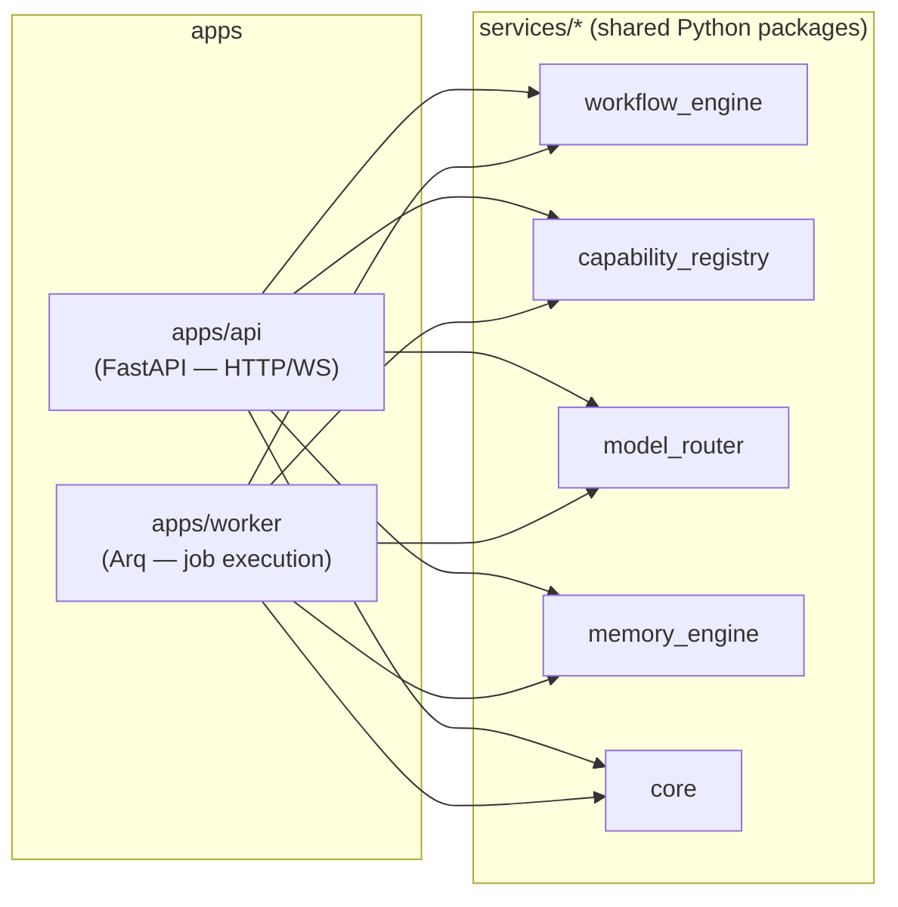

# 01 — Repository Structure & Monorepo Architecture

## 1. Decision: single polyglot monorepo

ForgeAI ships a TypeScript frontend and a Python backend from one repository.

**Alternatives considered:**

| Option                                       | Rejected because                                                                                                                                                                                                                                                                        |
| -------------------------------------------- | --------------------------------------------------------------------------------------------------------------------------------------------------------------------------------------------------------------------------------------------------------------------------------------- |
| Separate `forgeai-web` / `forgeai-api` repos | Every feature touches both the API contract and the UI that consumes it; cross-repo PRs and version-pinning overhead aren't worth it at this team size. Schema/type drift between frontend and backend is a real, recurring bug class this specifically avoids (see §4, generated SDK). |
| Nx                                           | Nx's value (distributed task caching, dependency graph, code generators) is strongest for large, mostly-JS/TS orgs. Half this repo is Python, where Nx's plugin ecosystem is thinner and adds a second thing to learn on top of `uv`. Not worth the overhead for a small founding team. |
| No monorepo tooling at all (plain folders)   | Loses build/test caching for the TS side as the app grows past a handful of packages.                                                                                                                                                                                                   |

**Chosen:** `pnpm` workspaces + `Turborepo` for the TypeScript side, `uv` workspaces for the Python side, unified by a root `Makefile` and `docker-compose.yml`. This is two lightweight, native-to-each-ecosystem tools rather than one heavyweight cross-language tool — each does the job it's actually good at.

## 2. Top-level layout

```
forgeai/
├── apps/
│   ├── web/               # Next.js frontend
│   ├── api/                # FastAPI HTTP/WebSocket surface (thin)
│   └── worker/              # Background execution process (workflows, capabilities)
├── packages/                # Shared TypeScript packages
│   ├── ui/                   # shadcn/ui-based design system, shared components
│   ├── config/                 # shared eslint / tsconfig / tailwind config
│   ├── sdk/                     # generated TS client from the backend's OpenAPI schema
│   └── types/                    # shared TS types for entities not covered by the SDK
├── services/                 # Shared Python packages (the "engine" layer — see below)
│   ├── core/                   # domain models, DB session/base, shared utilities
│   ├── workflow_engine/          # Layer 2
│   ├── capability_registry/        # Layer 3
│   ├── model_router/                 # Layer 4
│   ├── memory_engine/                  # Layer 5
│   └── integrations/                     # GitHub, Railway, Vercel, Gemini API clients
├── infra/
│   ├── docker/                # Dockerfiles per app
│   ├── railway/                 # Railway service configs
│   ├── github-actions/            # reusable workflow fragments
│   └── migrations -> apps/api/alembic  # (see note in 07-database-schema.md)
├── docs/
│   ├── architecture/            # this document set
│   ├── adr/                       # standalone Architecture Decision Records (see note below)
│   └── api/                         # hand-written API guides (generated reference lives in-app)
├── scripts/                   # dev-setup, seed data, one-off maintenance scripts
├── .github/workflows/
├── docker-compose.yml          # full local stack: postgres, redis, api, worker, web
├── docker-compose.dev.yml        # local-dev overrides (hot reload, exposed ports)
├── turbo.json
├── pnpm-workspace.yaml
├── pyproject.toml                # uv workspace root
├── Makefile                        # `make dev`, `make test`, `make migrate`, etc.
└── README.md
```

**Note on `docs/adr/` vs. this `docs/architecture/` set:** this directory is the _system-level_ architecture, written up front. `docs/adr/` is for _incremental_ decisions made during later sprints (e.g., "ADR-014: switch capability sandbox from Docker to gVisor") — short, dated, one-decision-per-file, following the standard ADR format. The [Architecture Decisions](07-database-schema.md) database table mirrors this same pattern for decisions made _inside_ user projects. Same discipline, three scopes (this platform's architecture, this platform's incremental decisions, and each user project's decisions).

## 3. Why `services/` exists as a layer distinct from `apps/api`

This is the single most important structural decision in the repository, because it resolves an ambiguity in the original brief (see [README §5](README.md#5-weaknesses-identified-in-the-original-brief-and-how-this-design-resolves-them), item 1).

The four AI layers (Workflow Engine, Capability Registry, Model Router, Memory Engine) must be callable from **two different processes**:

- `apps/api` — needs them for fast operations: starting a workflow, checking status, listing capabilities, submitting an approval decision.
- `apps/worker` — needs them to actually **execute** workflows and capabilities, which can run for seconds to hours and must not block an HTTP request/response cycle.

If the engine logic lived inside `apps/api`, the worker would either duplicate it (drift risk, the classic two-implementations-of-one-concept bug) or import internals from `apps/api` (a layering violation — HTTP app code becoming a library). Instead, `services/*` are the actual implementations, published as installable local packages; `apps/api` and `apps/worker` both depend on them and add nothing but process-specific glue (HTTP routing in one case, queue consumption in the other).



This also means each `services/*` package is independently unit-testable without spinning up FastAPI or a queue worker — important given these packages carry the most novel, highest-risk logic in the system (see [14-risks-and-tradeoffs.md](14-risks-and-tradeoffs.md)).

## 4. `apps/api` internal structure

Full rationale in [10-backend-architecture.md](10-backend-architecture.md); structure only, here:

```
apps/api/
├── src/forgeai_api/
│   ├── main.py                 # app factory, middleware registration
│   ├── core/                    # config, security, logging, exception handlers, DI providers
│   ├── db/                       # async session factory, declarative base, RLS session-var helper
│   ├── modules/                    # one folder per bounded context (see below)
│   └── events/                       # outbox relay, SSE broadcaster
├── alembic/                    # migrations (owns the schema; services/core defines the models)
├── tests/{unit,integration,e2e}/
└── pyproject.toml
```

Modules under `modules/` — each with its own `router.py`, `service.py`, `repository.py`, `schemas.py`, `exceptions.py` (models live in `services/core` since `apps/worker` needs them too):

`workspace` (users/orgs/projects/members) · `requirements` · `architecture` · `workflows` · `capabilities` · `sprints` (milestones/tasks) · `memory` (thin — mostly internal/admin) · `conversations` · `approvals` · `deployments` · `notifications` · `audit`

A CI-enforced import-boundary rule (via `import-linter` or equivalent) prevents `modules/X` from reaching into `modules/Y`'s `repository.py` or `models` directly — cross-module calls go through `service.py` public methods only. This is the concrete mechanism that keeps a modular monolith from decaying into "a big ball of mud" as more modules are added across sprints (flagged as a risk in [14-risks-and-tradeoffs.md](14-risks-and-tradeoffs.md)).

## 5. `apps/web` internal structure

Covered in full in [09-frontend-architecture.md](09-frontend-architecture.md).

## 6. Tooling summary

| Concern                              | Tool           | Why                                                                                                                                                                                                                             |
| ------------------------------------ | -------------- | ------------------------------------------------------------------------------------------------------------------------------------------------------------------------------------------------------------------------------- |
| JS/TS package management             | pnpm           | Fast, disk-efficient, strict dependency resolution (won't silently phantom-resolve undeclared deps like npm/yarn classic can).                                                                                                  |
| JS/TS task orchestration + caching   | Turborepo      | Native pnpm-workspace integration, remote caching for CI, minimal config.                                                                                                                                                       |
| Python package/dependency management | uv             | Workspace support (analogous to Cargo/pnpm workspaces), single fast tool replacing pip + venv + pip-tools.                                                                                                                      |
| Local orchestration                  | Docker Compose | Given in stack; one command brings up Postgres, Redis, api, worker, web together.                                                                                                                                               |
| Cross-cutting commands               | Makefile       | `make dev`, `make test`, `make lint`, `make migrate`, `make seed` — one command surface regardless of which half of the stack you're touching, so new contributors don't need to learn both ecosystems' native CLIs on day one. |

## 7. What is deliberately _not_ created yet

No `package.json`, `pyproject.toml`, Dockerfiles, or empty directories have been scaffolded as part of this document. Per the brief's development rules, scaffolding is Sprint 1 work, done after this architecture is reviewed — this document describes the target shape, it doesn't create it.

> **Amendment (2026-08-04, repository-foundation pass):** the statement above is now superseded, not deleted — per this document set's own documentation standard ([docs/engineering/12-documentation-standards.md](../engineering/12-documentation-standards.md) §2), a decision being revisited is recorded as revisited, not silently rewritten. A follow-up pass, scoped explicitly to engineering foundation rather than business logic, _did_ scaffold real workspace manifests, tooling config, and folder structure — see [docs/engineering/01-repository-scaffolding.md](../engineering/01-repository-scaffolding.md) for the as-built tree and package catalog. That pass also refined a few structural details versus the plan above: `apps/worker` was confirmed (not changed), but `services/prompts` was added, and the Docker layout was split into co-located Dockerfiles + a root `docker-compose.yml` + `infra/docker/` for shared fragments only, rather than a single `infra/docker/` holding everything. Full reasoning for each change: [docs/engineering/01-repository-scaffolding.md](../engineering/01-repository-scaffolding.md) §3. No database models, business logic, authentication, or APIs were added — that boundary held.
