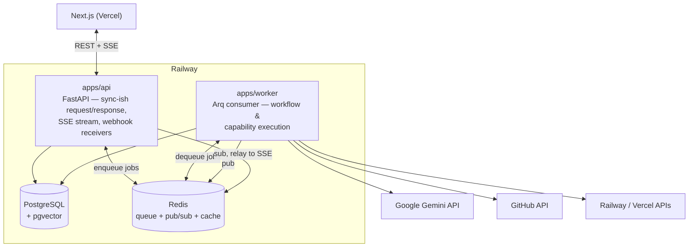

# 02 — Service Architecture

## 1. Why five layers, and why this particular split

The brief mandates: never build a monolithic AI chatbot. The five-layer split is the mechanism for that. Each layer has a single, testable responsibility, and — critically — each layer can change its _implementation_ without the others knowing:

- Swap Gemini for another provider → only the **Model Router** changes.
- Add a new engineering capability → only the **Capability Registry** changes.
- Add a new workflow (e.g., "Refactor Legacy Code") → only the **Workflow Engine**'s definition set changes.
- Change how memory is retrieved (e.g., pgvector → a dedicated vector DB) → only the **Memory Engine**'s internals change.

This is the standard argument for layered/hexagonal architecture, applied specifically to the parts of the system that are the least stable over time (AI providers, prompting strategies, and capability implementations all change far faster than the workspace/data model around them).

## 2. Layer responsibilities

| Layer                   | Owns                                                                                                | Does not own                                                              |
| ----------------------- | --------------------------------------------------------------------------------------------------- | ------------------------------------------------------------------------- |
| 1 — Workspace           | Users, Orgs, Projects, Membership, RBAC                                                             | Anything about _how_ work gets done inside a project                      |
| 2 — Workflow Engine     | Orchestration: sequencing steps, pausing for approval, checkpointing, resuming                      | The actual engineering judgment inside a step                             |
| 3 — Capability Registry | A catalog of versioned, invokable units of engineering work, each with input/output contracts       | Which LLM executes a capability, or how a workflow sequences capabilities |
| 4 — Model Router        | Mapping a capability invocation to a concrete LLM client + generation params; cost/usage accounting | Any engineering-domain logic                                              |
| 5 — Memory Engine       | Durable, queryable project context: structured records, event history, semantic recall              | Orchestration or engineering judgment — it only stores and retrieves      |

## 3. Process topology

Five layers does not mean five deployables. Mapping logical layers to physical processes 1:1 would be premature microservices for a system with no production traffic yet (see [14-risks-and-tradeoffs.md](14-risks-and-tradeoffs.md) — this is the "modular monolith vs. microservices" trade-off, decided in favor of the monolith for now). The actual process topology:

- **`apps/api`** handles anything that must respond in the timeframe of an HTTP request: CRUD on workspace entities, starting a workflow (which just enqueues it and returns an execution ID), submitting an approval decision, streaming live updates to the browser over SSE.
- **`apps/worker`** handles anything that runs an LLM or calls an external system: executing workflow nodes, running capabilities, calling GitHub/Railway/Vercel. This is deliberately kept off the request/response path — an "Implement Feature" workflow can legitimately run for a long time, and nothing about a web request should be waiting on it.
- Communication between them is **Redis-mediated**, not a direct RPC call: `apps/api` enqueues a job and returns immediately; `apps/worker` picks it up, executes, and publishes progress events back over Redis pub/sub, which `apps/api` relays to any subscribed browser over SSE. This decouples the two processes' lifecycles — the worker can be redeployed, scaled independently, or briefly down, without `apps/api` failing requests.

## 4. Why this isn't "just a task queue"

A generic background-job system (submit job, poll for result) would be sufficient for stateless work. It is _not_ sufficient for engineering workflows, which need to:

- **Pause indefinitely** waiting on a human (an approval might not be answered for hours or days) without holding a worker slot the whole time.
- **Resume exactly where they left off**, including all intermediate state, potentially after a deploy or crash.
- **Be inspected mid-flight** (the Workflow Timeline UI shows current node, not just "running" or "done").

This is why the Workflow Engine is built on LangGraph rather than a plain job queue with custom state-machine code — LangGraph's graph/state/checkpoint model gives durable pause-and-resume as a primitive rather than something to hand-roll. Full detail in [03-workflow-engine.md](03-workflow-engine.md).

## 5. Inter-layer contracts

Every call from Layer 2 → 3 → 4 crosses through a typed Pydantic contract, not a free-form dict, so that:

- Layer 2 (Workflow Engine) invokes a capability by key + version + a `CapabilityInput` matching that capability's declared schema — it does not know or care whether the capability is "just an LLM call" or a multi-step LangGraph subgraph internally.
- Layer 3 (Capability Registry) requests a model from Layer 4 by declaring requirements (needs tool-calling, needs a large context window, task category) — it does not know or care which provider or model ID actually gets returned.
- Layer 3 reads/writes Layer 5 (Memory) through `MemoryEngine.recall()` / `.remember()` — it does not know or care whether recall is a vector search, a SQL filter, or a hybrid of both.

This is what makes the "swap one layer without touching the others" property in §1 actually true rather than aspirational — it's enforced by the fact that nothing downstream imports another layer's internals, only its public contract module.

## 6. What Layer 1 (Workspace) actually is

Included for completeness since Layers 2–5 get dedicated documents and Layer 1 doesn't:

Workspace is the conventional multi-tenant SaaS core — `organizations`, `users`, `organization_members` (role: owner/admin/member/viewer), `projects`, `project_members`. It's deliberately the least novel part of the system, built with standard, well-understood patterns (see [07-database-schema.md](07-database-schema.md), [12-security-architecture.md](12-security-architecture.md)) so that design effort concentrates on the genuinely novel layers (2–5). Every other layer's records are scoped by `project_id`, which chains up to `org_id` — this is the backbone of both the data model and the tenant-isolation security model.
