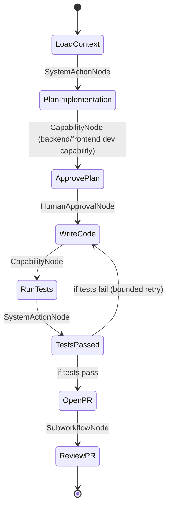
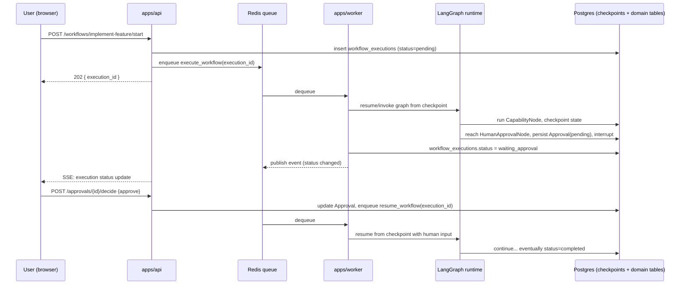

# 03 — Workflow Engine Architecture (Layer 2)

This is the highest-novelty, highest-risk component in ForgeAI (flagged as such in [14-risks-and-tradeoffs.md](14-risks-and-tradeoffs.md)) — it's what makes the product "structured engineering workflows" rather than "a chat window." It deserves the most design scrutiny and the earliest spikes.

## 1. Core abstraction: WorkflowDefinition → WorkflowExecution

- **`WorkflowDefinition`** — a versioned, named graph (e.g., `implement-feature`, `v3`) describing the steps of an engineering workflow, their sequencing/branching, and where human approval is required. Defined in code (a LangGraph `StateGraph`), registered in a `WorkflowRegistry`, and mirrored in the `workflow_definitions` table for discoverability and versioning metadata (see [07-database-schema.md](07-database-schema.md)).
- **`WorkflowExecution`** — one running (or completed, or paused) instance of a definition, bound to a specific `project_id`, with its own persisted state. This is the thing the Workflow Timeline UI renders.

Definitions are built on **LangGraph** because engineering workflows need three things a plain state machine or job queue doesn't give for free:

1. **Branching/conditional flow** — e.g., "Review PR" behaves differently if static analysis fails vs. passes. LangGraph graphs express this directly as conditional edges.
2. **Durable checkpointing** — state is persisted after every node, backed by a Postgres checkpointer, so a workflow survives a worker restart or redeploy mid-execution.
3. **Human-in-the-loop interrupts** — a node can pause the graph and wait for external input (an approval decision) without holding a worker process or thread hostage; the graph resumes from exactly that point once input arrives.

## 2. Node types

Every node in a workflow graph is one of four kinds:

| Node type           | Does                                                                                                     | Example                                                      |
| ------------------- | -------------------------------------------------------------------------------------------------------- | ------------------------------------------------------------ |
| `CapabilityNode`    | Invokes one Capability Registry entry via the Model Router, using project context from the Memory Engine | "Analyze requirements from the user's freeform input"        |
| `HumanApprovalNode` | Raises an interrupt, persists an `Approval` record, pauses the execution until a human decides           | "Approve this architecture before it's saved"                |
| `SystemActionNode`  | Deterministic, non-AI action against ForgeAI's own data                                                  | "Create `Feature` rows from the analyzed requirements"       |
| `SubworkflowNode`   | Invokes another `WorkflowDefinition` as a nested execution                                               | "Implement Feature" invoking "Review PR" once a PR is opened |

Keeping these as distinct, explicit node types (rather than letting any node "just call an LLM and also maybe write to the DB") is what makes workflows auditable — the Workflow Timeline can render a different visual treatment per node type, and the audit log can say precisely what _kind_ of thing happened at each step, not just that "something happened."

## 3. Example: Implement Feature (illustrative)



The point of walking through this example isn't the specific steps (those will be refined once we're actually building this workflow) — it's to show the pattern: **AI does the work, the graph decides what's next, and a human sits between "plan" and "write code."** That last part is a direct, structural expression of "Engineering before code generation" and "Human approval for critical decisions" — not a UI affordance layered on top.

## 4. Execution lifecycle



Two properties fall out of this design that matter a lot in practice:

- **A workflow waiting on approval costs nothing.** No worker, thread, or timer is held open — it's just a row in `workflow_executions` with `status = waiting_approval` and a checkpoint in Postgres. It could wait five minutes or five days at identical cost.
- **A worker crash mid-workflow is not data loss.** Because state checkpoints after every node (not just at the end), the worst case on restart is re-running the current node, not the whole workflow. Nodes that call external systems (see §6) are made idempotent specifically so this is safe.

## 5. Approval gates as a structural guarantee, not a convention

This is the resolution to weakness #5 noted in the [README](README.md#5-weaknesses-identified-in-the-original-brief-and-how-this-design-resolves-them). A category of actions is designated **irreversible-by-policy**: production deployment, merging a PR, deleting a resource, sending an external communication. Every `WorkflowDefinition` that includes one of these actions is required (by a definition-registration-time check, not just a code review convention) to route through a `HumanApprovalNode` immediately before it. This is enforced the same way a schema enforces a NOT NULL constraint — a workflow definition that violates it fails to register, so it can't ship.

This matters because it means "the AI went rogue and deployed to prod" isn't a risk that depends on every future engineer remembering to add a check — it's a property of the graph itself.

## 6. Idempotency and retries

- Every `CapabilityNode` and `SystemActionNode` execution is keyed by `(workflow_execution_id, node_key, attempt_scope)`, and side-effecting operations (creating a PR, triggering a deploy) check for an existing `CapabilityExecution`/`Deployment` record with that key before acting — so a retried node after a crash doesn't double-create a PR or double-deploy.
- Transient failures (LLM rate limits, network blips to GitHub/Railway) retry with exponential backoff at the node level, bounded (e.g., 3 attempts), after which the node transitions the execution to `failed` with the error recorded — surfaced in the Workflow Timeline, not silently swallowed.

## 7. Versioning and definition drift

`workflow_definitions` rows are immutable once published (`key`, `version`) — publishing a change to a workflow creates a new version rather than mutating the existing one. A running `WorkflowExecution` records which exact version it started under and continues on that version even if a newer one is published mid-flight. This avoids a specific, easy-to-hit real-world bug: an in-flight execution silently changing behavior (or breaking entirely, if a node was renamed) because someone shipped an edit to the workflow it's running.

## 8. Interfaces exposed to the rest of the system

```python
# services/workflow_engine/api.py — illustrative signatures, not implementation
async def start_workflow(definition_key: str, project_id: UUID, input: dict, started_by: UUID) -> WorkflowExecution: ...
async def resume_workflow(execution_id: UUID, human_input: dict) -> WorkflowExecution: ...
async def cancel_workflow(execution_id: UUID, reason: str) -> WorkflowExecution: ...
async def get_execution(execution_id: UUID) -> WorkflowExecutionState: ...
def subscribe(execution_id: UUID) -> AsyncIterator[WorkflowEvent]: ...  # backs the SSE stream
```

`apps/api` calls `start_workflow`/`resume_workflow`/`cancel_workflow` and enqueues the actual graph execution rather than running it inline — per [02-service-architecture.md](02-service-architecture.md), execution always happens in `apps/worker`.
