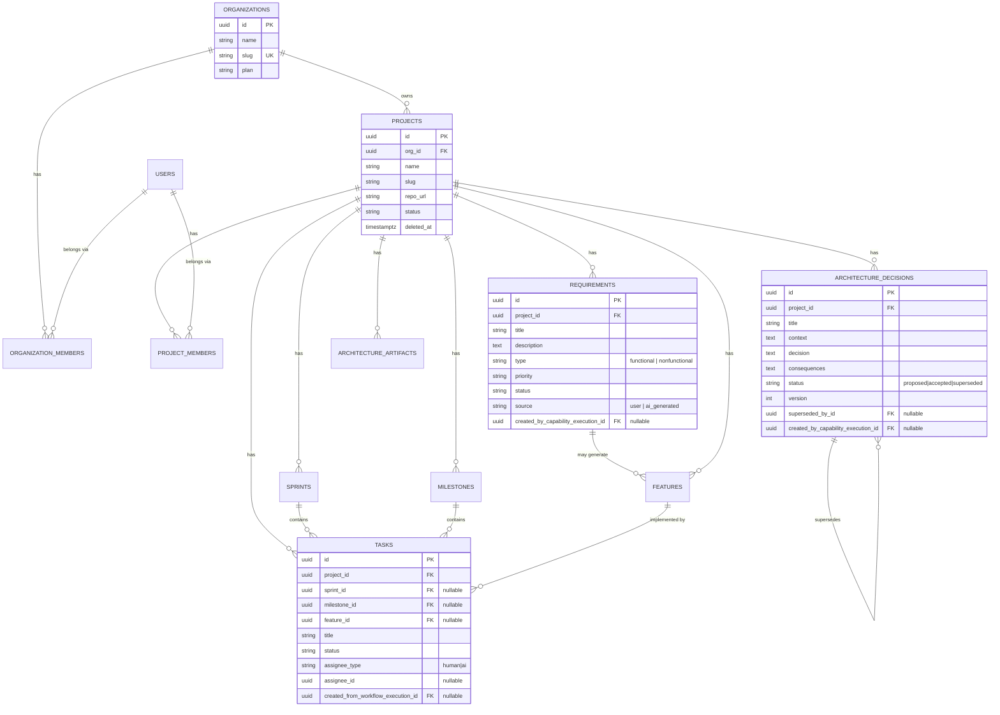
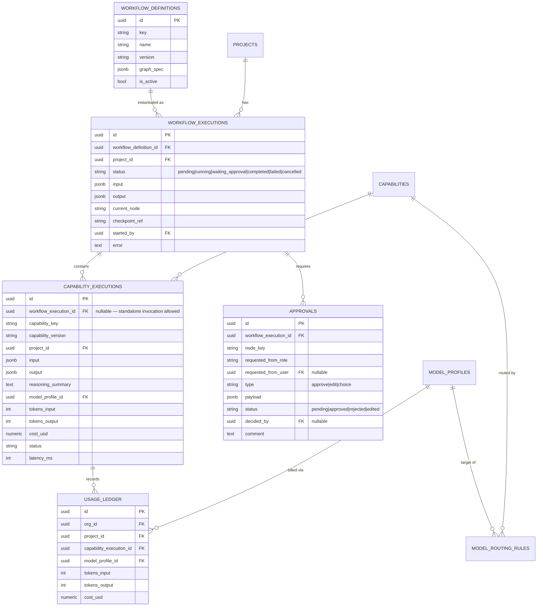
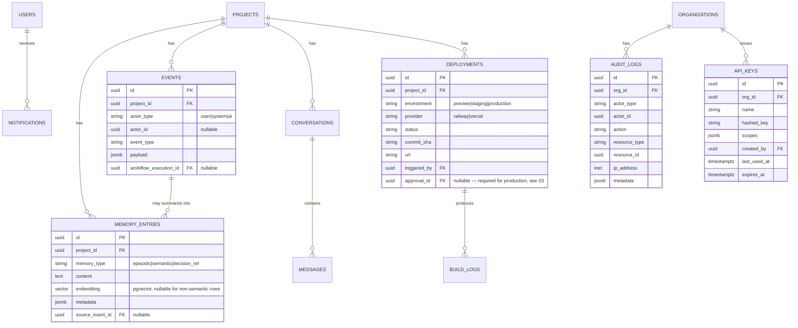

# 07 — Database Schema

## 1. Conventions

- **PostgreSQL**, single database, single schema for v1 (see §6 for the multi-tenancy model — tenancy is enforced by row scoping + RLS, not by separate schemas/databases per tenant).
- Every table: UUID primary key (`uuid_generate_v7()`-style time-ordered UUIDs, so PKs stay index-friendly under high insert volume — a plain-random UUIDv4 PK fragments B-tree indexes badly at scale), `created_at`, `updated_at` (trigger-maintained).
- Free-form/variable-shape data (workflow graph specs, capability input/output payloads, event payloads) is `JSONB`, never a stringified blob — keeps it queryable and indexable (GIN indexes where needed) without forcing a rigid column per payload shape that would need a migration every time a capability's schema evolves.
- Ownership: SQLAlchemy models are defined in `services/core` (so `apps/api` and `apps/worker` share one definition — see [01-repository-structure.md](01-repository-structure.md) §3); Alembic migrations live in `apps/api/alembic` since `apps/api` is the single writer of schema changes (the worker never runs migrations, avoiding races between two processes both trying to migrate on startup).
- Soft deletes (`deleted_at` nullable) on user-facing entities that need "undo"/audit trail (`projects`, `requirements`, `features`, `tasks`); hard deletes only for genuinely ephemeral data. Nothing in the AI-execution or audit tables (`capability_executions`, `events`, `audit_logs`) is ever deleted by the application — these are append-only by design.

## 2. Entity groups

Split into three diagrams for readability. All three key off `organizations`/`projects` from Group 1.

### Group 1 — Workspace & Planning



### Group 2 — Workflow Engine, Capability Registry, Model Router



### Group 3 — Memory, Collaboration, Deployment, Audit



## 3. Additions beyond the brief's listed entities, and why

The brief's entity list is a strong starting point but three gaps would bite quickly in production:

| Added table                                                       | Why it's necessary                                                                                                                                                                                                                                                               |
| ----------------------------------------------------------------- | -------------------------------------------------------------------------------------------------------------------------------------------------------------------------------------------------------------------------------------------------------------------------------- |
| `usage_ledger`                                                    | Without per-call cost tracking, there is no way to implement budget enforcement (Model Router, [06](06-model-router.md)) or the Analytics screen (UI list in the brief) — both need a ledger, not just a running total, so costs can be sliced by project/capability/model/time. |
| `api_keys`                                                        | The target users (developers, startups) will want CI and CLI access, not just browser sessions. Session-only auth would block the most natural integration point (a GitHub Action calling ForgeAI).                                                                              |
| `architecture_artifacts` (separate from `architecture_decisions`) | Decisions are the _why_ (ADR-style prose); artifacts are the _what_ (a diagram, a schema export, a rendered doc) that the Architecture Viewer displays. Conflating them into one table would force either prose-shaped storage for diagrams or diagram-shaped storage for prose. |

## 4. Multi-tenancy and isolation

**Chosen:** shared database, shared schema, every tenant-scoped table carries `org_id` and/or `project_id`, enforced at two independent layers:

1. **Application layer** — every repository method takes the current org/project scope as a mandatory parameter (not optional, not inferred) and filters on it. This is table stakes, not the whole story.
2. **Database layer — Postgres Row-Level Security.** Every tenant-scoped table has an RLS policy keyed on a session variable set at the start of each request (`SET LOCAL app.current_org_id = '...'`), e.g.:

   ```sql
   ALTER TABLE projects ENABLE ROW LEVEL SECURITY;
   CREATE POLICY tenant_isolation ON projects
       USING (org_id = current_setting('app.current_org_id')::uuid);
   ```

   This is defense-in-depth: a missing `WHERE org_id = ...` in application code — a realistic mistake in a fast-moving codebase, and a well-documented real-world source of cross-tenant data leaks — is caught at the database level instead of leaking another tenant's requirements, architecture, or code context. Given ForgeAI's data is _other companies' proprietary engineering IP_, this isn't optional hardening; it's treated as a baseline requirement. Full rationale in [12-security-architecture.md](12-security-architecture.md).

**Alternatives considered:** schema-per-tenant or database-per-tenant. Rejected for v1 — meaningfully more operational complexity (migrations must run N times, connection pooling gets harder) for isolation guarantees that RLS + app-layer scoping already provide at this stage. Revisit only if a specific enterprise customer requires physical data isolation as a contractual term (see [15-future-extensibility.md](15-future-extensibility.md)).

## 5. Indexing strategy (high-value indexes, not exhaustive)

- Every foreign key gets a btree index (SQLAlchemy/Alembic default is _not_ automatic on the FK side in Postgres — this must be explicit).
- `(project_id, status)` composite indexes on `workflow_executions`, `tasks`, `deployments` — the dominant query pattern is "active items for this project."
- `(project_id, created_at DESC)` on `events` — Activity Feed pagination.
- HNSW index (pgvector) on `memory_entries.embedding` — chosen over IVFFlat for better recall at query time without a separate training/build step, acceptable given expected per-project row counts (see [05-memory-engine.md](05-memory-engine.md) §2 for the scale ceiling this assumes).
- Partial index on `approvals WHERE status = 'pending'` — the pending-approvals-for-a-user query runs constantly (dashboard badge, notification checks) and should never scan resolved approvals.

## 6. Build logs: a deliberately bounded choice

`build_logs` stores log content directly in Postgres for v1, with a per-row size cap, rather than shipping logs to object storage or a log aggregation service. This is intentionally the simplest thing that works at MVP volume — and, like `pgvector` in [05](05-memory-engine.md), a bounded choice with a documented revisit trigger (log volume or retention requirements outgrowing in-DB storage) rather than an assumption of infinite scale. See [14-risks-and-tradeoffs.md](14-risks-and-tradeoffs.md).
