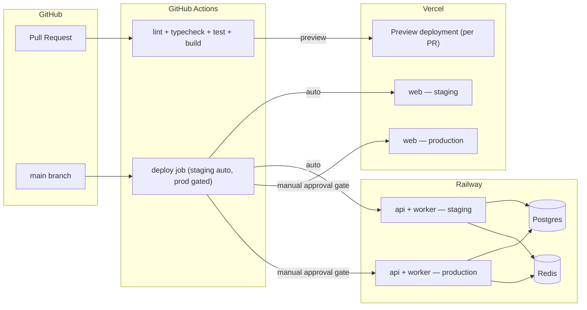
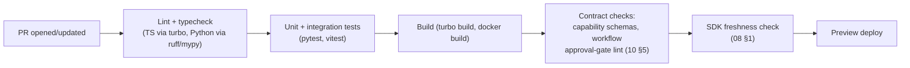

# 11 — Deployment Architecture

## 1. Topology

## 2. Frontend → Vercel, backend/worker → Railway

- **`apps/web` → Vercel.** Native Next.js hosting, global edge network, and — notably — automatic preview deployments per pull request. This is a direct product fit: ForgeAI's own "Review Pull Request" workflow benefits from every PR (including PRs to ForgeAI's own repo) getting an inspectable live preview, so the platform dogfoods the exact capability it offers users.
- **`apps/api` and `apps/worker` → Railway**, as separate services from the same monorepo (Railway supports multi-service monorepo deploys via per-service root directory + build config). Kept on Railway rather than Vercel because they're long-running/stateful processes (persistent DB connections, a queue consumer that must stay up) — not a fit for a serverless/edge execution model the way the frontend is.
- **PostgreSQL + Redis → Railway managed plugins** for now. Sufficient through at least Series-A-scale traffic for a product like this; the migration path to a dedicated managed provider (e.g., RDS, Neon) if/when it's outgrown doesn't require any application-code change, only a connection-string swap — noted as a bounded choice, not a permanent architectural ceiling.

## 3. Environments

| Environment | Trigger                       | Frontend             | Backend/worker                                                             | Approval required?                            |
| ----------- | ----------------------------- | -------------------- | -------------------------------------------------------------------------- | --------------------------------------------- |
| Preview     | Every PR                      | Vercel preview URL   | Optional: Railway PR environment for API, when the PR touches backend code | No — ephemeral, torn down on PR close         |
| Staging     | Merge to `main`               | Auto-deployed        | Auto-deployed                                                              | No                                            |
| Production  | Manual promotion from staging | Deployed on approval | Deployed on approval                                                       | **Yes** — GitHub Environments protection rule |

The production approval gate is a direct, deliberate echo of principle #3 ("human approval for critical decisions") applied to ForgeAI's _own_ delivery pipeline, not only to the product feature that enforces the same rule for users' deployments ([03-workflow-engine.md](03-workflow-engine.md) §5). Building the platform under the same discipline it imposes on its users is a consistency check worth keeping visible, not just a nice parallel.

## 4. Migrations

Alembic migrations run as a release step — a pre-deploy command (Railway supports this natively) that runs before the new application version starts receiving traffic. Because Vercel/Railway deploys aren't an instantaneous cutover, migrations follow the **expand/contract pattern**: additive changes (new nullable column, new table) ship and deploy before any code that depends on them; removing/renaming a column ships only after no running version reads the old shape. This avoids the standard rolling-deploy failure mode where the old and new app versions briefly run against incompatible assumptions about the same schema.

## 5. Observability (MVP baseline vs. deferred)

**MVP baseline (Phase 0–1, see [13-development-roadmap.md](13-development-roadmap.md)):**

- Structured JSON logs (`structlog` backend, `pino` frontend) with the correlation ID described in [10-backend-architecture.md](10-backend-architecture.md) §6, shipped to Railway's and Vercel's built-in log drains.
- Basic uptime/error alerting via Railway/Vercel's native integrations.

**Explicitly deferred, not designed in detail yet:** a dedicated observability stack (OpenTelemetry traces → a backend like Grafana/Axiom/Better Stack), distributed tracing across the api→worker→LLM-provider hop, and SLO dashboards. Called out explicitly as deferred rather than silently absent — log volume and incident frequency don't justify the operational overhead of a dedicated stack yet, but the correlation-ID convention adopted now is exactly what a future OpenTelemetry migration would key spans on, so nothing here needs to be redone, only extended.

## 6. Secrets

Railway and Vercel's built-in environment variable stores for MVP. A dedicated secrets manager (Doppler, or a cloud KMS) is future work, not because it's unimportant, but because platform-native env var storage is already access-controlled and audit-logged at the platform level, which is adequate until compliance requirements (SOC 2, customer contractual terms) demand a dedicated store with finer-grained rotation/audit — see [15-future-extensibility.md](15-future-extensibility.md). This is distinct from _user-provided_ secrets (a user's GitHub PAT, deploy tokens), which are application data, not infrastructure config, and are handled separately — see [12-security-architecture.md](12-security-architecture.md) §3.

## 7. CI pipeline shape

Every stage must pass before merge; none of them are skippable via `--no-verify`-equivalent shortcuts in CI, per the engineering standards in the brief.
