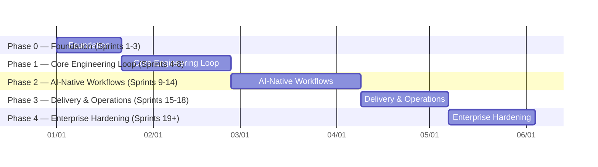

# 13 — Development Roadmap

This is a **phase-level** roadmap — it establishes sequencing and dependency order so the architecture can be validated end-to-end. It is intentionally not broken into the full 8-field sprint specs (goal, deliverables, folder changes, DB changes, API changes, UI changes, tests, acceptance criteria) the project's development rules require — those get produced one sprint at a time, starting with Sprint 1, only after this architecture is reviewed and accepted.

## Sequencing logic

The order below is driven by one rule: **de-risk the highest-novelty component first.** The Workflow Engine (LangGraph + Postgres checkpointing + human-in-the-loop interrupts) is the piece with the least precedent elsewhere in the stack and the most other features depend on it — building Requirements/Architecture/Sprints as plain CRUD first, then proving one real workflow end-to-end before building the rest of the capability catalog on top of it, is deliberately conservative. Building all 8 workflows in parallel before any one of them is proven would risk discovering a Workflow Engine design flaw only after it's expensive to change.

_(Dates are a placeholder timeline starting 2026-01-01 purely to render relative phase lengths — not a committed schedule. Actual pacing depends on team size and is set sprint-by-sprint per the roadmap's own rule.)_

## Phase 0 — Foundation

**Goal:** a deployable skeleton with nothing AI-shaped in it yet, proving the monorepo, auth, and deployment pipeline work end to end.

- Monorepo scaffold ([01-repository-structure.md](01-repository-structure.md)): pnpm/turbo + uv workspaces, Docker Compose local stack, Makefile.
- Layer 1 (Workspace): `organizations`, `users`, `organization_members`, `projects`, `project_members` — schema, migrations, CRUD API, RLS policies proven with a real cross-tenant test.
- Auth: email/password + GitHub OAuth, session cookies, API keys.
- CI/CD skeleton: lint/typecheck/test/build pipeline, staging auto-deploy, production approval-gated deploy ([11-deployment-architecture.md](11-deployment-architecture.md)).
- Empty dashboard shell UI (Next.js app shell, shadcn theme, auth flow, org/project switcher) — no workflow/AI UI yet.

**Exit criteria:** a user can sign up, create an org and project, and see it in a deployed staging environment, with tenant isolation verified.

## Phase 1 — Core Engineering Loop

**Goal:** prove the Workflow Engine and Capability Registry work end-to-end with one real, useful workflow — before building the other seven.

- Requirements module: schema, API, Requirement Wizard UI (manual entry first, no AI).
- Architecture Decisions module: schema, API, Architecture Viewer UI (manual entry first).
- Workflow Engine v1: LangGraph integration, Postgres checkpointer, the four node types ([03-workflow-engine.md](03-workflow-engine.md)), Workflow Timeline UI wired to real (not mocked) execution state.
- Capability Registry v1: registration mechanism, contract enforcement, first real capability (`requirements.analyze`).
- Model Router v1: single provider (Gemini), static rule-based routing, `usage_ledger` wired up from the first call onward (not retrofitted later).
- Memory Engine v1: structured + episodic only (no vector/semantic yet) — enough for `requirements.analyze` to have project context and for the Activity Feed to work.
- First real workflow shipped: **Gather Requirements**, fully wired: user input → capability → human approval gate → persisted requirements.

**Exit criteria:** a user runs Gather Requirements on a real project, sees live workflow progress, approves the output, and the result is queryable structured data — validating the hardest architectural bet in the system before building further on top of it.

## Phase 2 — AI-Native Workflows

**Goal:** broaden from one proven workflow to the core engineering loop the product is named for.

- **Generate Architecture** workflow + `architecture.design` capability, producing real ADRs.
- **Plan Sprint** workflow + `sprint.plan` capability; Sprint Board UI (Milestones, Sprints, Tasks).
- **Implement Feature** workflow: sandboxed code execution ([12-security-architecture.md](12-security-architecture.md) §4), GitHub integration (PR creation), the full plan → approve → write code → test loop from the [03-workflow-engine.md](03-workflow-engine.md) §3 example.
- Approval gates fully productionized across all shipped workflows (not just Gather Requirements).
- Memory Engine v2: `pgvector` semantic memory, `recall()`/`get_context_bundle()` wired into capabilities that need broader project context than structured data alone provides.
- Activity Feed + realtime (SSE) shipped as a first-class UI surface, not just a debug view.

**Exit criteria:** a project can go from a freeform idea to an open, AI-authored, human-approved pull request without leaving ForgeAI.

## Phase 3 — Delivery & Operations

**Goal:** close the loop from "code written" to "code running in production," and from "something broke" back to "diagnosed."

- **Review Pull Request** workflow + `pr.review` capability.
- **Fix Bug** workflow + `bug.diagnose` capability.
- Deployment integration: Railway/Vercel API clients, **Deploy Application** workflow, Deployments UI, `build_logs`.
- **Investigate Production Issue** workflow.
- Notifications (in-app; email/Slack are integration-layer additions, see [15-future-extensibility.md](15-future-extensibility.md)).
- Audit Logs UI (admin-facing).
- Basic Analytics screen, backed by `usage_ledger` (cost/usage by project, capability, model — data has existed since Phase 1, this is the first UI on top of it).

**Exit criteria:** all eight workflows named in the brief exist and are usable end-to-end; the product covers the full loop from idea to production to incident response.

## Phase 4 — Enterprise Hardening

**Goal:** the features that matter for larger teams and regulated customers, deliberately deferred because they're additive to a model already shaped for them (per [15-future-extensibility.md](15-future-extensibility.md)), not because they're unimportant.

- SSO/SAML, custom RBAC roles beyond the four base roles.
- Budget/usage analytics maturing into billing.
- Model Router: additional LLM providers, adaptive routing (opt-in, still explainable — see [06-model-router.md](06-model-router.md) §3).
- Dedicated observability stack (OpenTelemetry, distributed tracing — [11-deployment-architecture.md](11-deployment-architecture.md) §5).
- SOC 2 groundwork: formalizing what Phase 0–3 already logs and isolates into an auditable control set.

## What determines moving from one phase to the next

Not a calendar date — each phase's exit criteria above. Per the project's development rules, work proceeds sprint by sprint within a phase, and the next sprint isn't planned in detail until the current one is complete and accepted.
