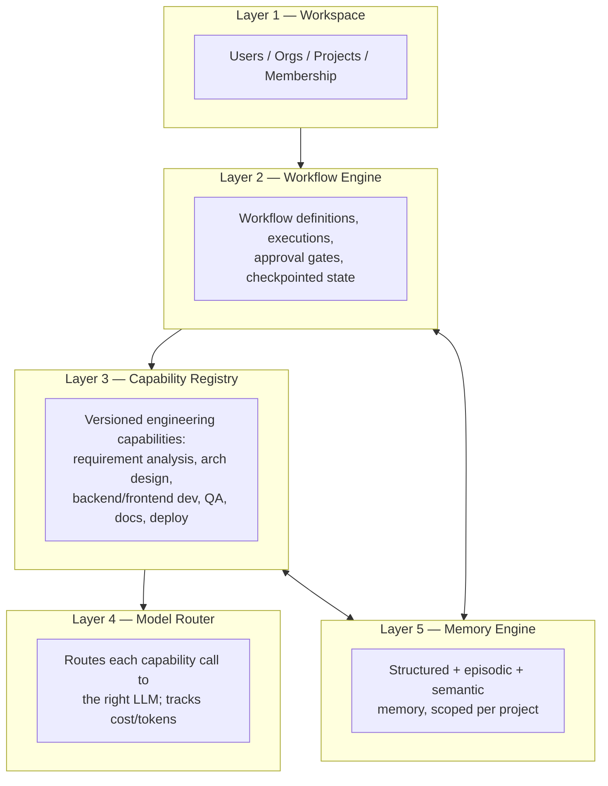

# ForgeAI — System Architecture

Status: **Draft for review — Sprint 1 has not started.**
Scope: Full-platform architecture for ForgeAI, an AI-native Software Engineering Workspace.

This directory is the persistent architectural record for ForgeAI. It is written to be checked into the repository under `docs/architecture/` on day one, because the product's own third principle — persistent engineering memory — should apply to ForgeAI's own construction, not just to the projects it manages for users.

## How to read this set of documents

| #   | Document                                                 | Answers                                                                                   |
| --- | -------------------------------------------------------- | ----------------------------------------------------------------------------------------- |
| —   | [README.md](README.md)                                   | Why does this exist, what are we building, what's the shape of the system?                |
| 01  | [Repository Structure](01-repository-structure.md)       | How is the monorepo laid out? What tools manage it?                                       |
| 02  | [Service Architecture](02-service-architecture.md)       | What are the five layers, what processes exist, how do they talk to each other?           |
| 03  | [Workflow Engine](03-workflow-engine.md)                 | How are engineering workflows defined, executed, paused for approval, and resumed?        |
| 04  | [Capability Registry](04-capability-registry.md)         | How are reusable AI engineering capabilities defined, versioned, and invoked?             |
| 05  | [Memory Engine](05-memory-engine.md)                     | How does ForgeAI remember a project across time?                                          |
| 06  | [Model Router](06-model-router.md)                       | How is the right LLM chosen per task, and how are cost/reliability controlled?            |
| 07  | [Database Schema](07-database-schema.md)                 | What are the entities, relationships, and multi-tenancy model?                            |
| 08  | [API Design](08-api-design.md)                           | What are the API modules, auth model, and realtime transport?                             |
| 09  | [Frontend Architecture](09-frontend-architecture.md)     | How is the Next.js app structured, and how does it stay in sync with live workflow state? |
| 10  | [Backend Architecture](10-backend-architecture.md)       | How is the FastAPI backend structured internally (Clean Architecture, DI, testing)?       |
| 11  | [Deployment Architecture](11-deployment-architecture.md) | How does code get to Railway/Vercel, and what do environments look like?                  |
| 12  | [Security Architecture](12-security-architecture.md)     | AuthN/AuthZ, tenant isolation, secrets, and — specifically — AI/tool-access risk.         |
| 13  | [Development Roadmap](13-development-roadmap.md)         | What gets built in what order, at a phase level?                                          |
| 14  | [Risks & Trade-offs](14-risks-and-tradeoffs.md)          | What are we betting on, and what would make us revisit the bet?                           |
| 15  | [Future Extensibility](15-future-extensibility.md)       | What does this design make easy later that a naive design wouldn't?                       |

Each document explains **what** was decided and **why**, including alternatives that were considered and rejected. Nothing here is intended to be read as unchangeable — it's a starting position for review, not a mandate.

---

## 1. What ForgeAI is

ForgeAI is a workspace where users manage **Engineering Workflows**, not a chat window in front of a model. A user creates a Project, and the system moves that project through structured, inspectable, resumable workflows — _Gather Requirements_, _Generate Architecture_, _Plan Sprint_, _Implement Feature_, _Review Pull Request_, _Fix Bug_, _Deploy Application_, _Investigate Production Issue_ — each of which orchestrates one or more AI **capabilities** under human supervision.

The product experience should read as **GitHub + Jira + Linear + Vercel + Notion**, not as a chatbot with a code plugin. That framing drives almost every decision in this document set: workflows are first-class, stateful, and durable; every AI action is attributable and explainable; and irreversible actions cannot proceed without a human decision recorded in the database.

## 2. Core principles, and how the architecture enforces each one

Principles are only useful if the architecture makes it _hard_ to violate them. Here's the mapping:

| Principle                             | Enforced by                                                                                                                                                                                                                                                      |
| ------------------------------------- | ---------------------------------------------------------------------------------------------------------------------------------------------------------------------------------------------------------------------------------------------------------------- |
| Projects before prompts               | `projects` is the root scope for every workflow, capability execution, and memory record — there is no global/project-less chat surface.                                                                                                                         |
| Engineering before code generation    | Requirements → Architecture → Sprint Plan are modeled as first-class entities and workflows that precede any "Implement Feature" workflow; a project cannot skip straight to code generation without those artifacts existing (see [03](03-workflow-engine.md)). |
| Human approval for critical decisions | Approval gates are a Workflow-Engine-level node type, not an application convention — a workflow definition that performs an irreversible action _cannot_ omit the gate (see [03](03-workflow-engine.md) §5, [12](12-security-architecture.md) §5).              |
| Workflow-driven execution             | All AI work happens inside a `WorkflowExecution` or a directly-invoked, still-audited `CapabilityExecution` — never an unstructured chat completion with no persisted record.                                                                                    |
| Persistent engineering memory         | The Memory Engine ([05](05-memory-engine.md)) is a first-class layer, not a side effect of chat history; structured decisions (ADRs), episodic events, and semantic recall are all queryable per project indefinitely.                                           |
| Explainable AI decisions              | Every `CapabilityExecution` persists a `reasoning_summary`; every architecture decision is stored as an ADR with context/decision/consequences, not just a generated diagram (see [04](04-capability-registry.md), [07](07-database-schema.md)).                 |
| Enterprise-grade architecture         | Modular monolith with enforced module boundaries, RLS-backed multi-tenancy, audit logging, versioned workflow/capability definitions — detailed throughout.                                                                                                      |

## 3. The five layers, at a glance

Layer 1 is what the user directly manipulates. Layers 2–5 are invisible infrastructure that make the workflows in Layer 1 actually work. This separation is the difference between "an AI coding agent with a UI bolted on" and "an engineering platform with AI inside it" — full detail in [02-service-architecture.md](02-service-architecture.md).

## 4. Technology stack (as given, with rationale noted where a choice existed)

| Concern               | Choice                                            | Notes                                                                                                                                                |
| --------------------- | ------------------------------------------------- | ---------------------------------------------------------------------------------------------------------------------------------------------------- |
| Frontend framework    | Next.js (App Router) + React + TypeScript         | Given.                                                                                                                                               |
| Styling / components  | Tailwind CSS + shadcn/ui                          | Given — also the right call for "must never look like ChatGPT" (see [09](09-frontend-architecture.md)).                                              |
| Diagrams / canvases   | React Flow                                        | Given — used for both Architecture Viewer and Workflow Timeline as two distinct instances (see [09](09-frontend-architecture.md)).                   |
| Backend framework     | FastAPI                                           | Given.                                                                                                                                               |
| ORM / migrations      | SQLAlchemy (async) + Alembic                      | Given.                                                                                                                                               |
| Primary datastore     | PostgreSQL                                        | Given — also hosts vector search via `pgvector` rather than a separate vector DB (decision, see [05](05-memory-engine.md)).                          |
| Cache / queue backing | Redis                                             | Given — also backs the background job queue (decision, see [10](10-backend-architecture.md)).                                                        |
| AI orchestration      | LangGraph + LangChain                             | Given — LangGraph's graph/state/checkpoint model is why the Workflow Engine can be durable and human-in-the-loop (see [03](03-workflow-engine.md)).  |
| LLM provider          | Google Gemini API (initial)                       | Given — but the Model Router is provider-agnostic from day one so this is a config value, not a hardcoded assumption (see [06](06-model-router.md)). |
| Containerization      | Docker + Docker Compose                           | Given.                                                                                                                                               |
| CI                    | GitHub Actions                                    | Given.                                                                                                                                               |
| Hosting               | Railway (backend/worker/data) + Vercel (frontend) | Given.                                                                                                                                               |

## 5. Weaknesses identified in the original brief, and how this design resolves them

The brief specifies _what_ to include but leaves several structural questions open. Per instruction, here is what was underspecified and the resolution chosen, so the reasoning is visible rather than silently baked in:

1. **Where do the four AI layers (Workflow Engine, Capability Registry, Model Router, Memory Engine) physically run?** Left implicit, this invites duplicating orchestration logic between the API process and any background worker. **Resolution:** they're built as independent Python packages under `services/` that both `apps/api` (request/response, fast paths) and `apps/worker` (long-running executions) import — one implementation, two call sites. See [01](01-repository-structure.md) and [02](02-service-architecture.md).
2. **No cost/usage tracking entity in the listed schema**, despite the product being LLM-cost-driven by nature. **Resolution:** added `usage_ledger` and per-org/project budget enforcement in the Model Router. See [06](06-model-router.md), [07](07-database-schema.md).
3. **No programmatic auth**, despite the target users (developers, startups) needing CI/CLI access, not just browser sessions. **Resolution:** added `api_keys` as a first-class auth mode alongside session auth. See [08](08-api-design.md), [12](12-security-architecture.md).
4. **Multi-tenancy strategy was unspecified.** Application-layer `WHERE org_id = ...` filtering alone is a well-known source of cross-tenant data leaks in fast-moving codebases. **Resolution:** Postgres Row-Level Security as a second, database-enforced layer beneath the application-layer scoping. See [07](07-database-schema.md), [12](12-security-architecture.md).
5. **"Human approval for critical decisions" was stated as a principle but nothing enforced it structurally** — a principle that lives only in application code can be bypassed by a bug or a future feature that forgets it. **Resolution:** irreversible actions (production deploy, PR merge, resource deletion) are only reachable through a workflow-definition node type that hard-requires an approval interrupt; there is no code path that invokes those capabilities outside a workflow. See [03](03-workflow-engine.md) §5, [12](12-security-architecture.md) §5.
6. **AI tool access (code execution, GitHub, deploy credentials) is a real prompt-injection blast-radius risk** that the brief doesn't mention. Given this product explicitly ingests external content (PR descriptions, issues) into prompts that drive capabilities with real tool access, this needed explicit treatment rather than being assumed away. **Resolution:** least-privilege, per-project-scoped tool credentials, sandboxed code execution, and explicit untrusted-content tagging. See [12](12-security-architecture.md) §4.
7. **Unbounded-scale claims were avoided.** Two choices in this design (`pgvector` for semantic memory, build logs stored inline in Postgres) are deliberately bounded, not infinitely scalable — each has a documented revisit trigger instead of a silent scaling cliff. See [14](14-risks-and-tradeoffs.md).

## 6. What this document set is not

It is not a sprint plan with acceptance criteria — that's produced one sprint at a time, per the project's development rules, starting after this architecture is reviewed and accepted. [13-development-roadmap.md](13-development-roadmap.md) gives phase-level sequencing only. It is also not code: no application code, config files, or scaffolding has been generated as part of this deliverable, by design.
